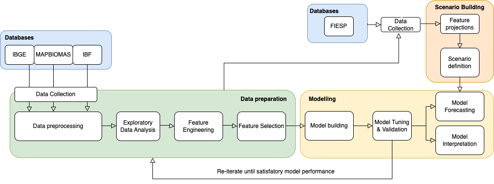
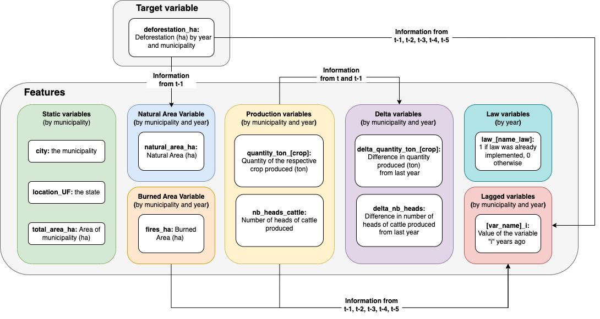

===============
Forecasting Deforestation in the Pantanal Biome, Brazil, using a machine-learning model
===============

Halting deforestation is imperative for safeguarding global ecosystems and mitigating climate change. Unfortunately, the Pantanal biome, a vital tropical wetland of international significance, faces a concerning surge in deforestation rates. If unabated, this trend may result in a 29.5% loss of its natural vegetation until 2030. Despite the successful application of contemporary statistical techniques in modeling deforestation in other regions, the Pantanal remains relatively understudied. This study employs simulation modeling to comprehend deforestation dynamics and predict ecosystem loss in the Pantanal by 2030. The XGBoost Machine Learning model is harnessed, integrating crucial features such as agricultural production, cattle head counts, burned areas, and past deforestation trends

Methodology
-----------

High level view of the project's methodology: 

Features Used
-------------

High level view of the features used during the project:

Development environment
-----------------------

To create and install python environment:

.. code:: bash

   make create-env

Then, activate it: 

.. code:: bash

   . ./activate

This will activate the conda environmnet, install the dependencies required and set some key paths. 

Dependencies
~~~~~~~~~~~~

To install dependencies:

.. code:: bash

   make install-deps

To compile dependencies:

.. code:: bash

  pip install pip-tools
  make compile-deps

Development configuration
~~~~~~~~~~~~~~~~~~~~~~~~

Create a file in the project's root dir called ``config.local.env``,
with the following structure:

::

   DATA_FOLDER="path to you local data folder"

Basic directory structure
------------------------------

:: 

   ├── config                 # Configuration directory, contains all configuration yamls
   ├── data                   # Local data directory for development
   ├── notebooks              # Jupyter notebooks directory
   ├── requirements           # Package requirements directory
   ├── runner                 # Main PROG directory
   │   ├── data_prep          # Data preparation tasks
   │   ├── engine             # Auxiliary task running functions
   ├── scripts                # Auxiliary scripts for simulations
   └── tests                  # Tests directory

Data configuration
------------------

The data configuration file is **10-data.yaml**.

These files define data location, format and everything else required to read/write those files.  
The data configuration files are used in the io module, which is the main way to perform read write data operations in the application.

Using the io module to access data
~~~~~~~~~~~~~~~~~~~~~~~~~~~~~~~~~~

The io module can perform read/write operation of data files (mostly tables and pickles).  
To use the module, find which `domain` (ex: raw, preprocessed) and `table/pickle` (ex: perm_area) you want to read/write and use the standard functions of the io module.

There are examples of usage of the io module below

Pandas table
~~~~~~~~~~~~

* Read:

.. code:: python

   io.load_table("raw", "table_name")

* Write:

.. code:: python

   io.save_table(preprocessed_table, "preprocessed", "table_name")

Pickle
~~~~~~

* Read:

.. code:: python

   io.load_pickle("raw", "pickle_name")

* Write:

.. code:: python

   io.files.save_pickle(pickle_variable, "preprocessed", "pickle_name")

Running tasks
--------------

A task is simply a function from a module. There are simple requirements
to be able to run them using the application standard process:

- Option 1: The task must accept \*args and \**kwargs
- Option 2: Add the decorator @click.command() on your function

The command to run a task has the following pattern:

- Pattern: `./run task module.path:function`

To run tasks, you will need to find which commands you want to run and
pass them as arguments to ``./run``. For example:

.. code:: bash

   ./run data-pipeline run-all

Run the following command line to see the basic usage of the project's
runner:

::

   ./run --help

The most common use cases is summarized in a few commands in the next subsections.

Data preprocessing
--------------------------------

In order to run the full data-pipeline, please use the following command:

.. code:: bash

   ./run all_data_prep build-all

Modelling and exploratory analysis
-----------------------------------

The modelling and the plots related to modelling can be found inside the file:

.. code:: bash

   ./notebooks/model.ipynb

Other supplementary analysis can be found in the notebooks folder. 

Jupyter
~~~~~~~~

Run the following command:

.. code:: bash

   . ./jupyter

This will set some useful env variables before launching Jupyter

